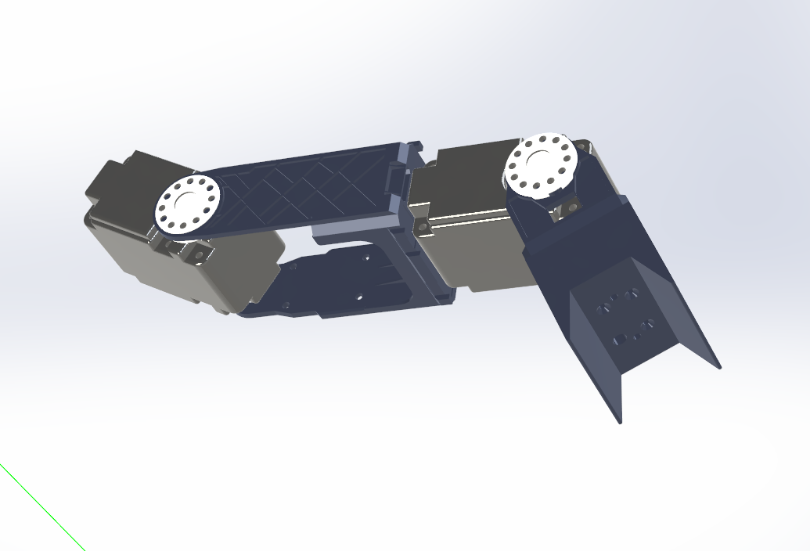
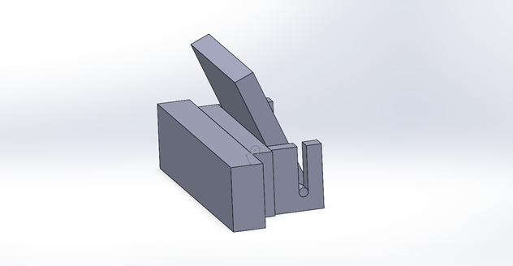
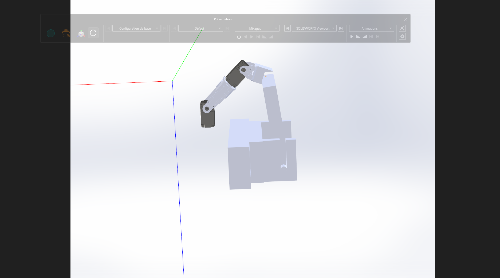

# Bras Robotique - Système de Mesure et Basculement de Carrés de Fouille

## Équipe
- **Abdallah M chiri** (Moi)
- **Diadie Diawara** - [GitHub: diawara-02](https://github.com/diawara-02)

## Description

Système de bras robotique à 3 servomoteurs Herkulex pour la mesure et le basculement automatique des carrés de fouille lors d'une compétition de robotique. Le bras analyse la résistance électrique des carrés pour déterminer leur couleur, puis les bascule selon un pattern prédéfini.

## Démonstration

[<video controls src="https://github.com/amchiri/BRAS_MESURE-COMPETITION_ROBOTIQUE/blob/master/video_180_abdallah_diadie.mp4" title="https://github.com/amchiri/BRAS_MESURE-COMPETITION_ROBOTIQUE/raw/main/video_180_abdallah_diadie.mp4"></video>](https://github.com/user-attachments/assets/a26b9969-c911-46ff-beee-e5012b18148c)

> **Note** : Si la vidéo ne s'affiche pas ci-dessus, vous pouvez la télécharger : [video_180_abdallah_diadie.mp4](https://github.com/amchiri/BRAS_MESURE-COMPETITION_ROBOTIQUE/blob/master/video_180_abdallah_diadie.mp4)



## Fonctionnalités

- **Mesure de résistance** : Identification de la couleur des carrés de fouille (jaune, bleu, rouge) via pont diviseur de tension
- **Reconnaissance de pattern** : Détermination automatique du pattern parmi 4 configurations prédéfinies
- **Basculement sélectif** : Manipulation des carrés selon leur couleur et le camp (jaune/violet)
- **Contrôle 3 axes** : Servomoteurs Herkulex DRS-0101/0201 (IDs: 100, 101, 102)



## Matériel

- **Microcontrôleur** : NXP LPC1768 (mbed)
- **Servomoteurs** : 3x Herkulex DRS-0101/0201 (baudrate 115200)
  - ID 100 : Base
  - ID 101 : Milieu
  - ID 102 : Haut
- **Capteurs** :
  - Potentiomètre/pont diviseur (p20) pour mesure de résistance
  - Interrupteur de camp (p7)
  - Bouton de contrôle (p5)
- **Indicateurs** : 2 LEDs (LED1, LED2)



## Structure du Projet

```
MyPart/
├── ARM_GRAB.cpp              # Programme principal
├── Herkulex_Library_2019/    # Bibliothèque Herkulex
│   ├── fonctions_herkulex.h
│   └── fonctions_herkulex.cpp
├── mbed-os/                  # Framework mbed OS 6
├── asset/                    # Fichiers 3D et ressources
│   └── *.stl                 # Modèles 3D des pièces
├── images/                   # Images et captures
├── main.h
└── mbed_app.json
```

## Ressources 3D

Les fichiers STL et autres ressources pour l'impression 3D et l'assemblage sont disponibles dans le dossier [`MyPart/asset/`](MyPart/asset/).

## Logique de Fonctionnement

1. **Mesure initiale** : Le bras positionne le capteur sur le carré de fouille
2. **Analyse** : Lecture de la tension pour identifier la couleur
   - Rouge : 0.37-0.42V
   - Jaune : 0.70-0.78V
   - Bleu : 0.80-0.87V
3. **Décision** : Comparaison avec 4 patterns prédéfinis
4. **Action** :
   - Couleur alliée → Basculement
   - Couleur ennemie → Ignorer (LED bleue)
   - Rouge → Ignorer (LED rouge)

## Compilation

### Prérequis
- Mbed CLI 2 ou Mbed Studio
- Compilateur ARM GCC

### Commandes
```bash
cd MyPart
mbed-tools compile -m LPC1768 -t GCC_ARM
```

Ou utiliser PlatformIO dans VSCode.

## Configuration

Les patterns sont définis dans `ARM_GRAB.cpp` :
```cpp
int tabref[4][6] = {
    {Mycolor, Mycolor, rouge, Enemy_color, Mycolor, 0},  // Pattern 0
    {rouge, Mycolor, Mycolor, Mycolor, Enemy_color, 0},  // Pattern 1
    {Mycolor, Mycolor, rouge, Mycolor, Enemy_color, 0},  // Pattern 2
    {rouge, Mycolor, Mycolor, Enemy_color, Mycolor, 0}   // Pattern 3
};
```

## Notes Techniques

- Adapté pour mbed-os 6 (migration depuis mbed-os 5)
- Communication série Herkulex via `UnbufferedSerial`
- Temps de déplacement : 40ms (PLAYTIME)
- Tolérance de position : ±16 unités


